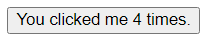

## Demo 1

### Description
In demo 1, we want to create a button with a text message "You clicked me ... times.". The count will increment by 1 every time the button is clicked.



### Codes
Below is the element in the HTML:
```html
<div id="components-demo">
  <button-counter></button-counter>
</div>
```

Below is how we can create this element by Vue.
```js
Vue.component('button-counter', {
  data: function () {
    return {count : 0}
  },
  template: '<button v-on:click="count++">You clicked me {{ count }} times.</button>'
})

// Define a new component called button-counter
new Vue({ 
  el: '#components-demo' 
})
```

### Explanation

#### Common Vue Keywords:
- **Component**: In Vue, a compoent is a reusable and self-contained unit that encapsulates a specific piece of functionality or UI. In our example, we defined a component named "button-counter" using `Vue.component.`

- **Data**: The `data` option in a component is used to define the initial state of the component. In our example, the `data` function returns an object with a `count` property, initialized to 0.

- **Template**: The `template` option in a component defines the structure and layout of the component. It uses HTML-like syntax and can include Vue directives (e.g. `v-on:click`) for handling dynamic behavior.

#### How our example works

- **`Vue.component('button-counter', {...})`**: This line registers a global component named 'button-counter'. It takes two arguments: the name of the component ('button-counter') and an object that defines the component's options (`data` and `template`).

- **`new Vue({ el: '#components-demo' })`**: This creates a new Vue instance and mounts it on the element with the ID 'components-demo'. This instance acts as a container for our Vue components. In our HTML, we have placed the "button-counter" component inside the element with the ID 'components-demo'.

- **`<button-counter></button-counter>`**: This is where the connection happens. In our HTML, we use the `<button-counter>` custom element, which corresponds to the component we defined. Vue then takes care of rendering the component's template and managing its data.

#### Summary
The Vue instance with `el: '#components-demo'` acts as a container for the `button-counter` component. When Vue encounters the `<button-counter>` tag in the HTML, it knows to render the template of the 'button-counter' component at that location. The data and behavior of the component are encapsulated within the component itself.