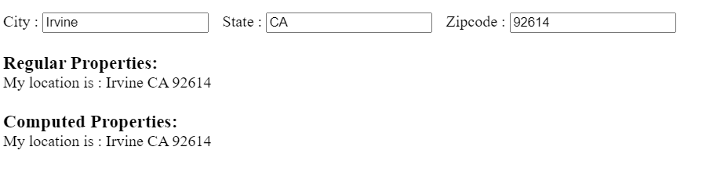

## Demo 1

### Description
In this demo, we will display the location using both `methods` and `computed`.



### Code
```HTML
<div id = "computed_props">
  City : <input type = "text" v-model = "city" />
  State : <input type = "text" v-model = "state"/>
  Zipcode : <input type = "text" v-model = "zipcode"/>
  
  <h3>Regular Properties:</h3>
  <p>My location is : {{ city }} {{ state }} {{ zipcode }}</p>
  
  <h3>Computed Properties:</h3>
  <p>My location is : {{ getlocation }}</p>
</div>
```

```js
const vm = new Vue({
  el: '#computed_props',
  data: {
    city: "",
    state: "",
    zipcode: ""
  },
  computed: {
    getlocation: function() {
      return `${this.city} ${this.state} ${this.zipcode}`;
    }
  }
})
```

### Explanation
**In the above JS code:**
- The `data` object contains 3 properties: `city`, `state`, and `zipcode`. These properties are reactive, meaning that changes to them will trigger reactivity in the Vue instance.
- The `computed` object contains a single computed property, `getlocation`. The getter function for `getlocation` uses the values of `city`, `state`, and `zipcode` to create a formatted string that represents the complete location.

**In the above HTML template:**
- There are 3 input fields for `city`, `state`, and `zipcode`, each of which is bound to the corresponding data property using `v-model`.
  - This means that when you type into these input fields, the corresponding data properties are updated.
-   In the "Regular Properties" section, you directly output the values of `city`, `state`, and `zipcode`. This is a straightforward display of the individual data properties.
- In the "Computed Properties" section, you use the `getlocation` computed property to display a formatted string representing the complete location. The string is automatically updated whenever any of the dependent data properties (`city`, `state`, or `zipcode`) change.

### Why Computed Properties

Here is an example using `methods` instead of using `computed` property.

```js
const vm = new Vue({
  el: '#computed_props',
  data: {
    city: "",
    state: "",
    zipcode: ""
  },

  // change is here:
  methods: {
    getLocation: function() {
      return `${this.city} ${this.state} ${this.zipcode}`;
    }
  }
});
```

And in the HTML template:

```HTML
<!-- ... -->
<h3>Using Method:</h3>

<!-- change is here. Note the use of () to call the method -->
<p>My location is: {{ getLocation() }}</p>
```

While this approach works, there are some key differences and considerations:
1. **Syntax in the Template:** With a `computed` property, you can access it in the template just like a data property (`{{ getlocation }}`, not `{{ getlocation() }}`). This is because methods are functions, and Vue expects you to call them.

2. **Caching:** `Computed` properties are cached based on their dependencies, meaning they won't be re-evaluated unless one of their dependencies changes. `Methods`, on the other hand, are re-invoked whenever there's a re-render, regardless of whether their dependencies have changed or not. This could lead to potentially unnecessary re-evaluations.

3. **Readability and Maintainability:** `Computed` properties are often more readable and maintainable, especially when the logic involves deriving a value from multiple data properties. They encapsulate the logic in a property-like syntax rather than having to explicitly call a method.

#### Summary
While using `methods` is a valid approach, `computed` properties are often preferred for their concise syntax, automatic caching, and better integration with the reactivity system in Vue. They are a powerful tool for keeping your template code clean, especially when dealing with derived values based on your component's state.
