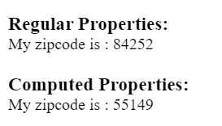

## Demo 2

In this demo, we want to generate a random zipcode in two ways: using `methods` and using `computed`.



To generate a random 5-digit number from '00001' to '99999', you can use `Math.random() * 99998 + 00001`.

### Code

```HTML
<div id = "computed_props">
  
  <h3>Regular Properties:</h3>
  <p>My {{ zip }} is : {{ getRandomNumR() }}</p>
  
  <h3>Computed Properties:</h3>
  <p>My {{ zip }} is : {{ getRandomNumC }}</p>
</div>

```

```js
const vm = new Vue({
  el: '#computed_props',
  data: {
    zip: "zipcode"
  },
  methods: {
    getRandomNumR: function() {
      return Math.round(Math.random() * 99998 + 00001);
    }
  },
  computed: {
    getRandomNumC: function() {
      return Math.round(Math.random() * 99998 + 00001);
    }
  }
})
```

