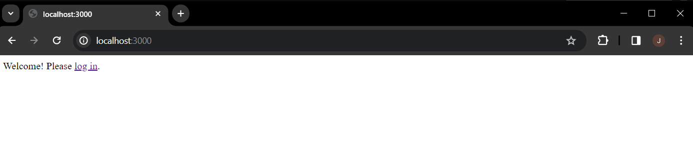
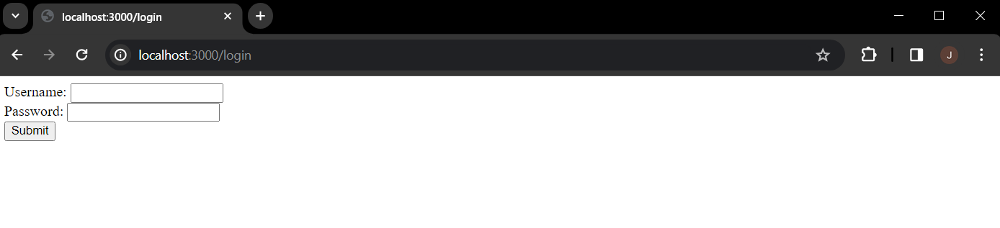
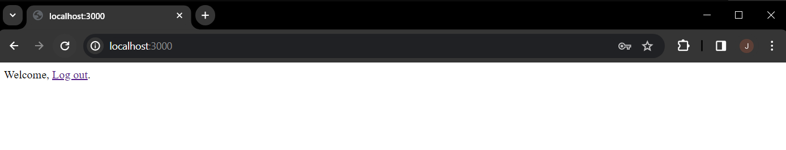

## Getting Started
Run the application by `node server.js`.

Then hit `localhost:3000` in your browser.

## Tests

### Home Page
You should be seeing the home page - "Welcome! Please log in!".



### Login Page
Click "log in". It should also work when you hit `http://localhost:3000/login` directly.



### Login with Username Password

#### With Invalid Username or Invalid Password
You should be redirected back to the login page.


You should be seeing status code 302 (for being redirected back to the login page) and then 200 (for `GET /login`).

#### With Valid Username-Password Combination
Valid combination is defined by you in the file `users.js`.



You should be seeing status code 302 again (for being redirected to the home page `/`, but this time signed in) and then 200 (for `GET /`).

We are seeing different message but on the same endpoint because we handled the login result in `home.ejs`.

```js
<% if (!user) { %>
	<p>Welcome! Please <a href="/login">log in</a>.</p>
<% } else { %>
	<p>Welcome, <a href="/logout">Log out</a>.</p>
<% } %>
```

### Logout
As you, the user who was logged in, log out, you should be redirected back to the home page.


This time, you should be seeing the text "Welcome! Please log in.".
