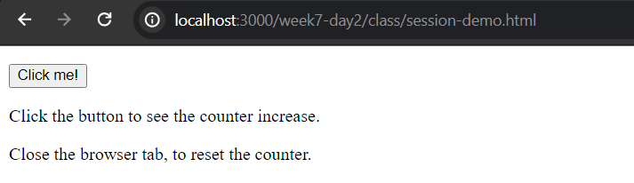
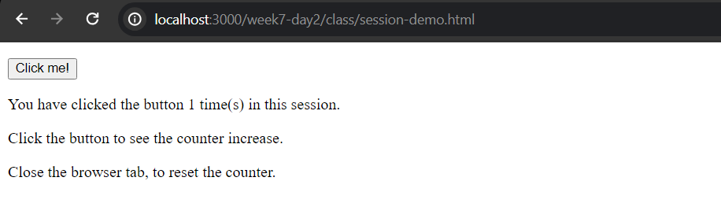
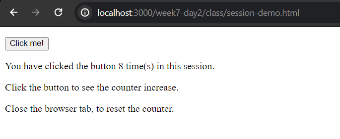
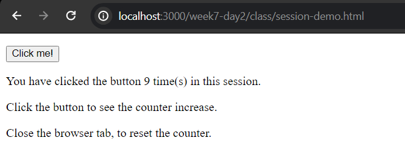
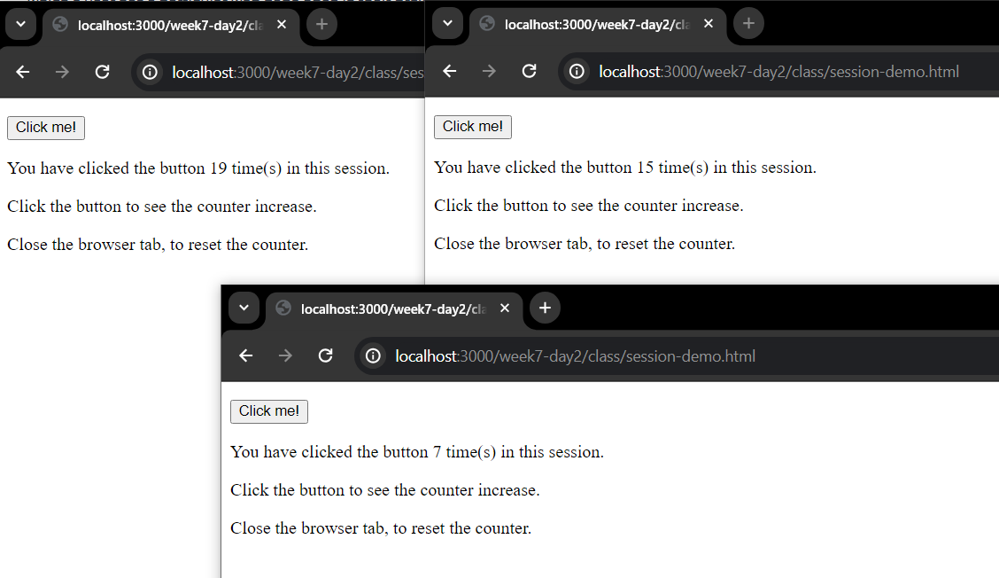

## Description

### Step 1
As you open the HTML in your browser (for me the path is `http://localhost:3000/week7-day2/class/session-demo.html`), you should see the following starting display:


A button "Click me!".

### Step 2
As you open the page for the first time, and when you hit "Click me!", you should be seeing this message:


### Step 3
As you continue to click the button, you should see the count increasing.



### Step 4
Now, refresh the page. You should be seeing the starting page again.


A button "Click me!".

However, as you click the button, you will NOT see the counter to count from 1. It will continue counting from where you left.



This effect demonstrates the session storage.

### Step 5
Now, open a new tab and visit the same page `http://localhost:3000/week7-day2/class/session-demo.html`. You don't need to close the old tab.


Then, as you click the button, you will notice that the counter now starts from 1 again.


### Step 6
Last, open the page in multiple tabs. Click the button and then switch to a different tab, and repeat this process arbitrarily as you wish.

You will see that the counter will NOT "interfere" among each other.



## Code Explanation

```js
function clickSessionCounter() {
    if (typeof(Storage) === "undefined") {
        document.getElementById('result').innerHTML = 'Sorry, your browser does not support web storage ...';
        return
    }

    if (sessionStorage.clickcount) {
        sessionStorage.clickcount = Number(sessionStorage.clickcount) + 1;
    } else {
        sessionStorage.clickcount = 1;
    }
    document.getElementById('result').innerHTML = `You have clicked the button ${sessionStorage.clickcount} time(s) in this session.`;
}
```

### 1. What is `Storage`? What does `typeof(Storage)` try to do?
The `Storage` interface is part of the Web Storage API and provides methods to interact with session storage and local storage.

For `typeof(Storage)`, it is a JavaScript expression that checks if the web browser supports the Web Storage API. 

If `typeof(Storage)` returns `"undefined"`, it means that the `Storage` object is not defined, indicating that the browser does not support web storage.

The Web Storage API is widely supported in modern web browsers, and it's part of the HTML5 specification. However, there might be some rare scenarios where a user is using a very old or uncommon browser that doesn't support it.

### 2. What is `sessionStorage`?
`sessionStorage` is one of the Web Storage API objects.

It provides a way to store key/value pairs in a web browser with a lifespan limited to the duration of the page session.

### 3. What is a "page session" then?
A "page session" refers to the duration in which a user interacts with a particular instance of a web page.

The concept of a session is not standardized across all contexts, and its specifics can vary based on the technology being used. In the context of web storage, which includes `sessionStorage`, a "page session" typically refers to the time during which a user has a particular web page open in their browser.

Here are some key points related to a "page session"

- **Lifespan**: The data stored in `sessionStorage` is available only for the duration of the page session. It persists as long as the user is "actively interacting" with the page. It gets cleared when the user closes the browser tab or window.

- **Tab or Window Specific**: Each browser tab or window has its own instance of `sessionStorage`. Data stored in one tab or window does NOT affect the data in another.

- **Storage Scope**: Data stored in `sessionStorage` is specific to a particular origin (a combination of protocol, domain, and port). This means that pages from different origins (e.g., different domains) cannot access each other's `sessionStorage`.

### 4. What does `sessionStorage.clickcount` try to do?
As mentioned earlier ...

> `sessionStorage` ... provides a way to store key/value pairs in a web browser with a lifespan limited to the duration of the page session.

So, here, I'm creating a variable (or key) called "clickcount" within the `sessionStorage` object, and I'm assigning values to it.

- **`session.clickcount` does not exist**: That is, it is the first time the button is clicked in the session. Then based on our code, we initialize `sessionStorage.clickcount` with the value 1.

- **`session.clickcount` exist**: That is, it is not `undefined`, `null`, or an empty string. Based on our code, it indicates that a previous count has been stored. So, we increment the existing count by 1.

Overall, `session.clickcount` is used to keep track of how many times the button has been clicked **in the current session**.
