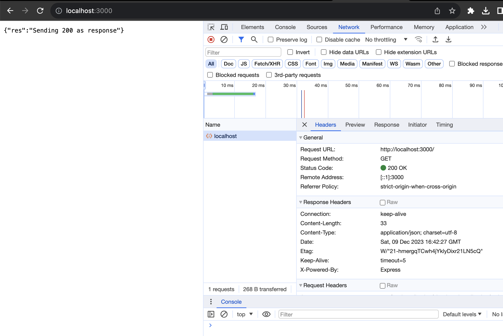
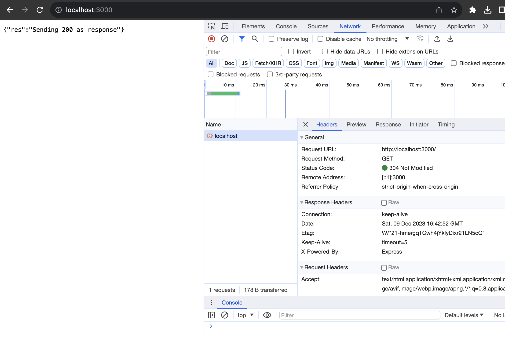
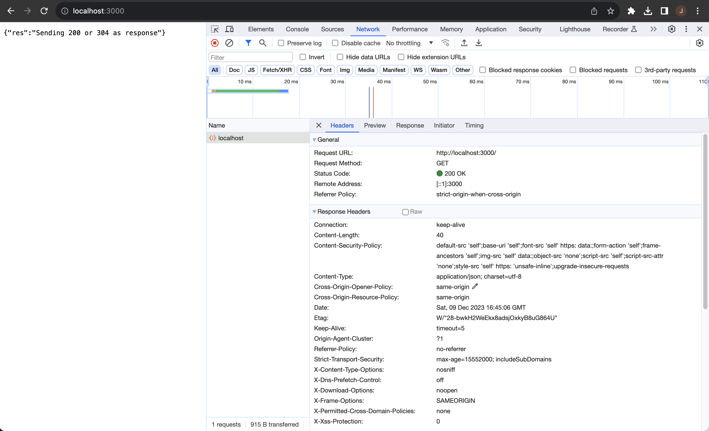

## Getting Started

Create a simple vanilla Express app with an endpoint `/`.

### Step 1
Run `npm init -y` to use the default setting.

### Step 2
Run `npm install express helmet --save` to install `express` and `helmet`.

### Step 3
Prepare a simple `app.js`.

### Step 4
Run the app by `node app`. You should be seeing the response body defined in your `app.js` (`{"res":"Sending 200 or 304 as response"}`) as you hit `localhost:3000`.

## Test

### Without using `helmet`
Notice the status code 200 in the response header.

\* If you are seeing status code 304 instead of 200, here's why. The 304 response status code is the servers' way of letting the browser know that the response hasn't changed and is still valid. So the browser (e.g. Google Chrome) display a cached response with status code 304.

### Using `helmet`
Notice that there are more fields related to security in the response header.

